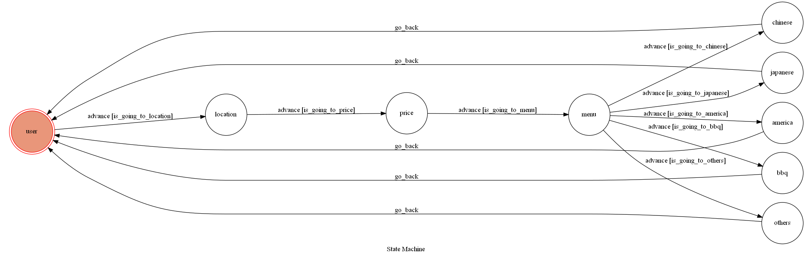

    

## FSM

    

[**Finite State Machine**](https://en.wikipedia.org/wiki/Finite-state_machine) is implemented for the state management of the users. A FSM is maintained for each individual user. This way, every user has their own independent state, and the operations between two different users will not affect each other.

Finite state machine is a model in [Theory of Computation](https://en.wikipedia.org/wiki/Theory_of_computation). This model is implemented in App. Each feature is represented by a **state**, and the button that user pressed on the carousel template will trigger the **transitions** between states. The FSM graph is drawn by **GraphMachine** in [transitions.extensions](https://github.com/pytransitions/transitions).

## Features

選擇所在城市

    

選擇價位

    

選擇想要吃怎樣的餐點

    

使用網路爬蟲從網頁抓取符合條件且正在營業的餐廳資料，並隨機選擇一個餐廳

    

## QRCode

    

